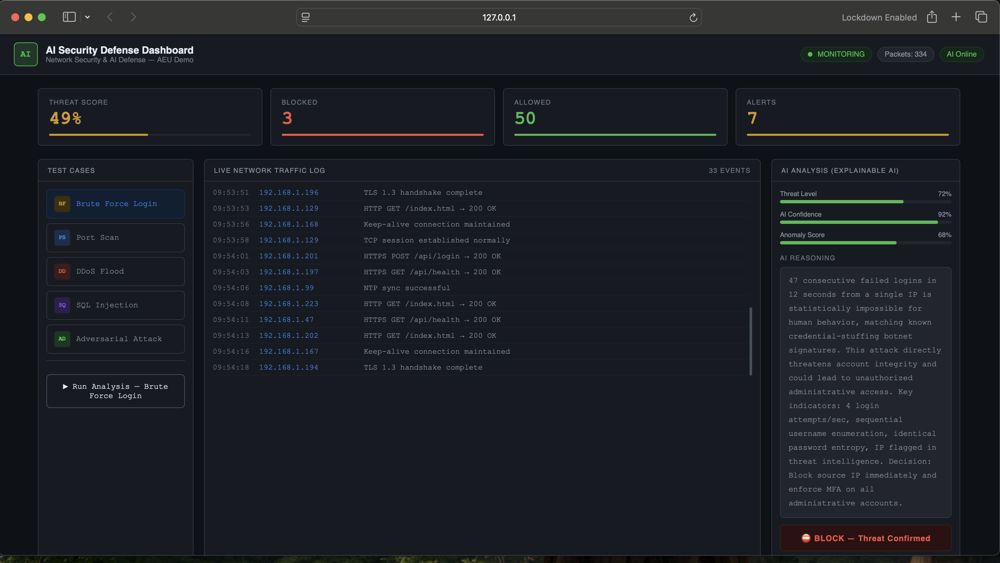

# AI Security Defense Dashboard
### AEU Network Security & AI Defense — Classroom Demo

A real-time web dashboard built with Python Flask that demonstrates
AI-powered network security monitoring and threat detection.

## Demo


---

## Features
- **Live traffic log** — simulated real-time network packets via SSE
- **5 attack test cases** — Brute Force, Port Scan, DDoS, SQL Injection, Adversarial
- **AI analysis (XAI)** — Explainable AI reasoning for each detected threat
- **Decision engine** — BLOCK / MONITOR / ALLOW verdict with explanation
- **Detection history** — tracks all test runs in the session

---

## Setup (3 steps)

### 1. Install dependencies
check before run 
```bash

rm -rf .venv
python3 -m venv .venv
source .venv/bin/activate

pip3 install -r requirements.txt
```

### 2. Set your API key (optional — fallback responses work without it)
```bash
# Windows
set ANTHROPIC_API_KEY=sk-ant-...

# macOS / Linux
export ANTHROPIC_API_KEY=sk-ant-...
```

### 3. Run the dashboard
```bash
python app.py
```

The app will auto-open your browser to **http://localhost:8888**.

To disable auto-open:
```bash
export AUTO_OPEN_BROWSER=0
```

---

## How to Use in Class

1. Open the dashboard on the projector browser
2. Click any **Test Case** on the left panel
3. Click **Run Analysis** — watch the live log fill with events
4. The AI panel on the right explains what happened and why
5. The **Decision** box shows BLOCK / MONITOR / ALLOW with AI reasoning
6. Run multiple tests to build up the **Detection History**

---

## Test Cases Explained

| Test Case | Attack Type | Concepts Covered |
|-----------|-------------|-----------------|
| Brute Force Login | Credential stuffing from a botnet | Rate limiting, account lockout |
| Port Scan | Nmap-style reconnaissance | SYN flood detection, IDS signatures |
| DDoS Flood | Volumetric botnet attack | BGP blackhole, CDN scrubbing |
| SQL Injection | SQLi with sqlmap tooling | WAF, input validation |
| Adversarial Attack | ML evasion techniques | Adversarial resilience, XAI |

---

## Architecture

```
Browser (SSE)  ←──── Flask (app.py)
    │                    │
    │                    ├── /stream       SSE real-time events
    │                    ├── /run-test     start attack simulation
    │                    └── /ai-analyze   Anthropic API call
    │
    └── Live Log + AI Panel + History
```

---

## Requirements
- Python 3.8+
- Flask 3.x
- anthropic SDK (optional — fallback AI responses included)
